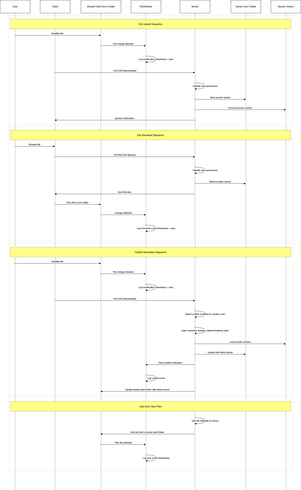
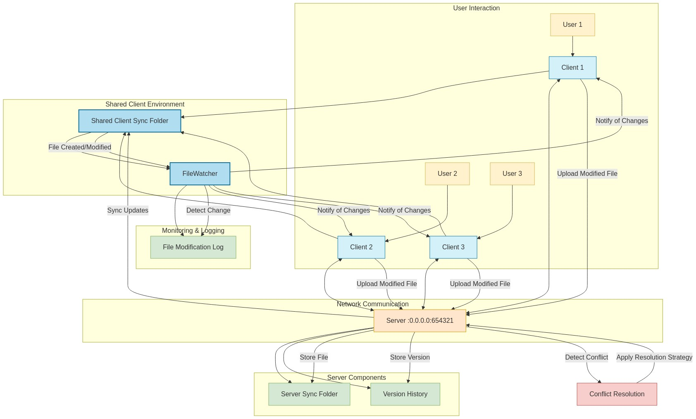

# TCP-IP-Server-and-Client-File-Sync-

## **Project: Distributed File Synchronization (Dropbox-like)**
**Goal**: Build a Linux-based system where multiple clients sync files with a central server using TCP/IP. 
 
---
 
### **1. Existing Tools & Research References** 
| Name | Description | Relevance | 
|------|-------------|-----------| 
| **Dropbox** | Cloud file sync using delta encoding. | Commercial example of real-time sync. | 
| **rsync** | Linux tool for efficient file transfer. | Inspiration for partial/delta sync. | 
| **Syncthing** | Open-source P2P file sync. | Decentralized approach (optional extension). | 
| **OwnCloud** | Self-hosted file-sharing. | Similar server-client model. | 
| **Research Paper**: *"A Low-Bandwidth Network File System"* (LBFS) | Focuses on chunk-based sync. | Useful for optimizing transfers. | 
 
---
 
### **2. Step-by-Step Implementation Plan** 
 
#### **Phase 1: Project Setup & Basic TCP Communication** 
✅ **Goal**: Establish a basic client-server connection. 
🔹 **Steps**: 
1. **Choose a language** (Python recommended for simplicity). 
2. **Set up a TCP server** (using `socket` in Python). 
3. **Clients connect to the server** (IP/port binding). 
4. **Test sending "Hello" messages** between client/server. 
 
📌 **Deliverable**: 
- Basic client-server code that exchanges text messages. 
 
---
 
#### **Phase 2: File Monitoring & Change Detection** 
✅ **Goal**: Detect when files are modified in a folder. 
🔹 **Steps**: 
1. **Choose a sync directory** (e.g., `~/sync_folder`). 
2. **Use `watchdog` (Python) or `inotify` (C)**: 
   - Track file **create, modify, delete** events. 
3. **Log changes** (e.g., `file.txt was modified at 12:30 PM`). 
 
📌 **Deliverable**: 
- A script that prints file changes in real-time. 
 
---
 
#### **Phase 3: File Transfer Protocol** 
✅ **Goal**: Sync files between client and server. 
🔹 **Steps**: 
1. **Define a simple protocol**: 
   - Example: `UPLOAD filename|data` / `DOWNLOAD filename`. 
2. **Implement file transfers**: 
   - Client sends new/modified files to the server. 
   - Server stores files in a central repo. 
3. **Handle conflicts** (e.g., if two clients edit the same file). 
 
📌 **Deliverable**: 
- Clients can upload/download files manually. 
 
---
 
#### **Phase 4: Delta Sync (Optimization)** 
✅ **Goal**: Only send modified parts of files (like `rsync`). 
🔹 **Steps**: 
1. **Split files into chunks** (e.g., 1KB blocks). 
2. **Compare checksums** (MD5/SHA-1) to detect changes. 
3. **Send only modified chunks** instead of the whole file. 
 
📌 **Deliverable**: 
- Faster syncs by avoiding redundant transfers. 
 
---
 
#### **Phase 5: Conflict Resolution & Consistency** 
✅ **Goal**: Handle cases where two clients edit the same file. 
🔹 **Steps**: 
1. **Use timestamps** (last-modified wins). 
2. **Or, create conflicted copies** (`file_conflict.txt`). 
3. **Optional**: Allow manual merge (advanced). 
 
📌 **Deliverable**: 
- Logs showing how conflicts are resolved. 
 
---
 
#### **Phase 6: Final Demo & Testing** 
✅ **Goal**: Simulate real-world usage. 
🔹 **Steps**: 
1. **Run 2+ clients and 1 server**. 
2. **Edit files on one client** and verify sync. 
3. **Test edge cases**: 
   - Large files (>100MB). 
   - Offline mode (queue changes). 
 
📌 **Deliverable**: 
- Live demo showing real-time sync. 
 
---
 
### **3. Expected UML Diagrams (For Report)** 
1. **Use Case Diagram**: 
   - Actors: `User`, `Server`. 
   - Actions: `Upload`, `Download`, `Conflict Resolve`. 
   

2. **Class Diagram**: 
   - Classes: `FileManager`, `NetworkHandler`, `ConflictResolver`. 
   
 
---
 
### **4. Future Extensions (For Bonus Points)** 
- **Mobile app integration** (Android sync client). 
- **End-to-end encryption** (like Signal). 
- **LAN sync mode** (without a central server). 
 
---
 
### **Summary of Steps** 
1. **Basic TCP connection** (client ↔ server). 
2. **Detect file changes** (`watchdog`/`inotify`). 
3. **Transfer files** (full → delta optimization). 
4. **Resolve conflicts** (timestamp/versioning). 
5. **Demo & refine**. 
